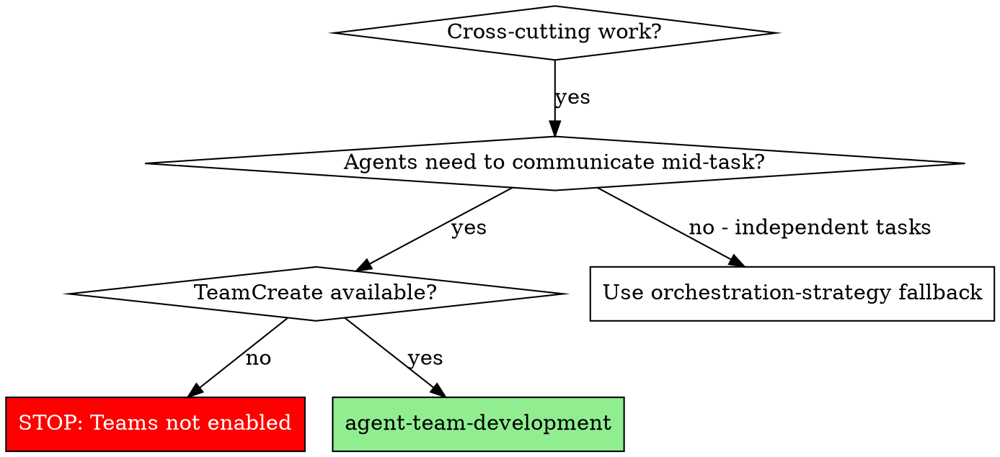
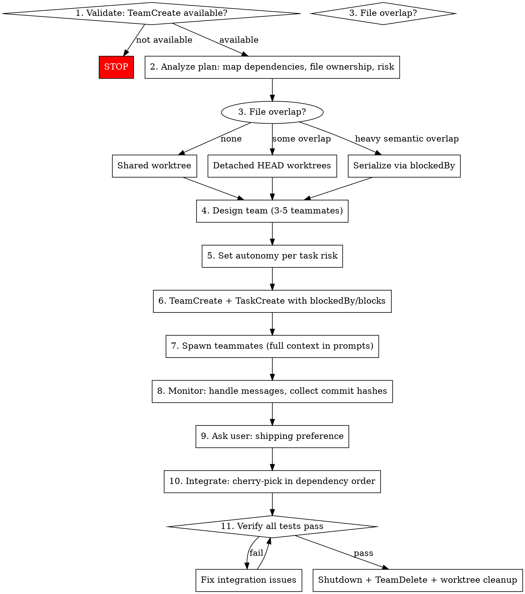

# Agent Team Development

## Overview

End-to-end Agent Teams orchestration for cross-cutting project work requiring inter-agent communication and configurable autonomy.

**Core principle:** Teammates work in parallel isolation; the leader integrates BEFORE shutdown. Lost work from premature shutdown cannot be recovered.

## Prerequisites — Hard Gate

**STOP immediately if the TeamCreate tool is NOT in your available tool list.**

Agent Teams requires `CLAUDE_CODE_EXPERIMENTAL_AGENT_TEAMS` to be enabled. Check: look for `TeamCreate` in your tools. If it is absent, teams are not enabled. Do NOT fall back silently — the orchestration-strategy skill owns fallback logic and should not have routed here.

## When to Use



## The Workflow



## Team Design

**Sizing:** 3-5 teammates. Target 5-6 tasks per teammate. Costs scale linearly — don't over-staff.

| Agent Type | When to Use |
|------------|-------------|
| general-purpose | Implementation tasks (default) |
| Explore | Research, codebase analysis, discovery tasks |

**Model selection:**

| Model | When |
|-------|------|
| Sonnet | Default for all teammates (cost-efficient) |
| Opus | Complex architectural decisions, critical shared components only |

**Autonomy levels (technical settings, not colloquial):**

| Level | Mechanics | When |
|-------|-----------|------|
| self-organizing | Teammates call TaskList, self-claim unassigned unblocked tasks via TaskUpdate | Low-risk independent tasks |
| lead-controlled | Leader assigns every task via TaskUpdate; reviews output before marking complete | High-risk, shared state, architectural decisions |

Default to the autonomy level from the orchestration-strategy handoff. If no handoff: use **lead-controlled for sequential/dependent tasks** and **self-organizing for fully independent tasks**. Override per-task based on risk.

**Spawn prompts MUST be self-contained.** Teammates have NO conversation history. Every spawn prompt must include:
- Full task specification
- Dependency context (what depends on this, what it depends on)
- File ownership and scope boundaries (what NOT to modify)
- Worktree path if using isolation
- Squash requirement (see Worktree Isolation below)
- Reporting format (commit hash + completion message)

## Worktree Isolation

**Use when:** Any two teammates modify the same file (even trivially). When in doubt, isolate.

**Do NOT use when:** All tasks touch completely separate files and there is zero overlap.

### Setup (detached HEAD — zero branch cleanup overhead)

```bash
# Leader runs this before spawning each teammate
git worktree add --detach .claude/worktrees/<task-id>
```

Location: `.claude/worktrees/<task-id>/` (e.g., `.claude/worktrees/task-4/`)

**Why `--detach`:** Creates no named branch. The commit hash is the only artifact. After `git worktree remove`, the commit becomes unreachable and is pruned by `git gc`. Zero cleanup overhead.

### Agent Contract (mandatory for all worktree agents)

Each teammate working in a worktree MUST follow this contract:

```bash
# Step 1: Record base immediately on entry
BASE=$(git rev-parse HEAD)

# Step 2: Work normally, make intermediate commits as needed

# Step 3: Before reporting — squash ALL work into ONE commit
git reset --soft $BASE
git commit -m "<task-id>: <description>"

# Step 4: Report single commit hash to leader
echo "DONE: $(git rev-parse HEAD)"
```

**The leader collects:** `{ task_id → single_commit_hash }` — one hash per task, no exceptions.

**NEVER report intermediate commit hashes.** If an agent reports multiple commits, instruct it to squash before proceeding.

## Integration

**Ask the user BEFORE starting integration:**

```
"How do you want to ship this work?"
  1. Single branch, one PR — all tasks cherry-picked onto one branch
  2. Stacked PRs — separate branch per task, stacked for dependent chains
     (only available for linear dependency chains — NOT for DAG dependencies)
  3. Just integrate locally — cherry-pick onto current branch, you handle shipping
```

**Option 2 limitation:** Stacked PRs require a linear chain (A → B → C). If any task has two or more parents (DAG shape), fall back to Option 1 for that subset and explain why.

### Integration Procedure

**Pre-conditions (ALL must be true before starting):**
- All teammates have reported completion with commit hashes
- All teammates are still alive (worktrees intact, commits accessible)
- You have the complete `{ task_id → commit_hash }` map
- You have the task dependency graph
- User has chosen shipping preference

**Integration loop:**

```
For each task in topological dependency order:
  1. git cherry-pick <commit_hash>
  2. If conflicts → resolve (see Conflict Resolution)
  3. Run build + test (commands from plan or CLAUDE.md; ask user if neither specifies)
  4. Tests pass → record success, continue
  5. Tests fail → diagnose and fix before continuing
```

### Ordering Rules

1. **Dependency order is primary** — tasks that others depend on integrate first
2. **Fully independent tasks (no dependencies and nothing depends on them)** — integrate smallest diff first (smaller changes are less likely to create conflicts, giving larger changes a stable base). Independent tasks can integrate before "foundation" tasks — they have no ordering constraint.
3. **Track what is at HEAD after each cherry-pick** — critical for conflict resolution context

**Example:** Tasks A(200 lines, foundation) → B, C; D(30 lines, independent). Integrate D first (smallest, independent), then A, then B(50 lines) before C(150 lines), then whatever depends on both B and C.

### Conflict Resolution

```
1. Read conflict markers in affected files
2. Identify both tasks: Task A (current HEAD), Task B (failing cherry-pick)
3. Read both task descriptions from the plan (full spec)
4. Resolve preserving both tasks' intents
5. git add <resolved files> && git cherry-pick --continue
6. Run build + test
7. Pass → continue
8. Fail → fix the combination bug, amend commit, re-verify
```

**When NOT to auto-resolve — surface to user instead:**
- Two tasks have genuinely contradictory intents (both change the same behavior incompatibly)
- Resolution requires an architectural decision beyond leader authority
- Repeated test failures after resolution — something fundamentally wrong about the combination
- Conflict spans many files or is too complex to resolve confidently

**User prompt format:**
> "Tasks [A] and [B] both modify [file/function] with conflicting approaches. [A] is doing: [summary]. [B] is doing: [summary]. How should I combine them?"

## Shutdown Ordering

> **STOP BEFORE SHUTDOWN — CRITICAL: Lost work cannot be recovered.**

**NEVER shut down teammates before integration is complete.**

When a teammate sends "all done" or "ready to shut down":

```
DO NOT shut down yet. Instead:
  1. Confirm you have the commit hash from this teammate
  2. Continue waiting until ALL teammates have reported
  3. Complete integration (cherry-pick all hashes, verify tests)
  4. Only AFTER full test suite passes on integrated result:
     a. Send shutdown to each teammate
     b. git worktree remove .claude/worktrees/<task-id> for each
     c. TeamDelete
```

**Why this matters:** Worktrees are cleaned up when teammates shut down. Any unintegrated commits are destroyed. There is no recovery.

**The sequence is: complete → integrate → verify → shutdown. Never: complete → shutdown → integrate.**

## Error Recovery

| Scenario | Recovery Steps |
|----------|----------------|
| Teammate unresponsive / crashed | Check worktree for partial work. Assess: is it salvageable? If yes: commit any uncommitted changes (`git add && git commit -m "wip: partial"` in worktree), then spawn new agent into same worktree with (a) full task spec, (b) "continue from partial state — review existing commits", (c) the BASE commit hash for squashing, (d) squash requirement. If no: `git worktree remove`, `git worktree add --detach` (fresh), respawn from scratch. |
| Teammate reports success but tests fail after cherry-pick | Reject: send message with exact failure. Teammate re-fixes + re-squashes + reports new hash. If teammate is dead: spawn new agent into same worktree to fix and re-squash. |
| Leader context window fills up | Hard limit. Surface to user. Recommend: reduce team size (3 max for complex projects), or break into sequential batches. |
| Worktree in dirty state (uncommitted changes block cherry-pick) | Inspect worktree. If partial work looks valid: commit it (becomes one of the intermediate commits). Then instruct agent to squash if alive, or squash as leader if agent is dead. |
| Agent commits to wrong files (scope violation) | Review diff before cherry-picking. If scope violated: reject, re-dispatch with explicit scope constraints. Never cherry-pick scope violations. |
| Agent reports multiple commit hashes (failed to squash) | Verify: `git log --oneline $BASE..$HASH`. If multiple commits: instruct live agent to squash. If agent is dead: leader squashes in the worktree (`git reset --soft $BASE && git commit`) before cherry-picking. |

## Critical Rules

**1. NEVER shut down before integrating.** Complete → integrate → verify → shutdown.

**2. Spawn prompts must be self-contained.** Teammates have no conversation history. If a teammate needs to know something, put it in the spawn prompt.

**3. One commit per task.** All worktree agents MUST squash to a single commit before reporting. Verify before cherry-picking.

**4. Keep agents alive until integration succeeds.** Don't send shutdown requests until the full test suite passes on the integrated result.

**5. Partition file ownership.** Prefer no two teammates editing the same file. Where overlap is unavoidable, use worktree isolation.

**6. Clean up when done.** Active teammates burn tokens even when idle. TeamDelete after integration is complete.

**7. Default to Sonnet.** Only use Opus for genuinely complex or critical tasks. Cost scales with team size × model cost.

## Common Mistakes

| Mistake | Correct Behavior |
|---------|-----------------|
| Shutting down teammates when they say "done" | Wait for ALL teammates to complete, then integrate FIRST |
| Using `git worktree add ./path` without `--detach` | Always use `git worktree add --detach .claude/worktrees/<task-id>` |
| Cherry-picking before collecting all hashes | Collect complete `{ task_id → hash }` map first |
| Skipping build+test after each cherry-pick | Verify build + tests after EVERY cherry-pick, not just the last |
| Assigning "high autonomy" without specifying self-organizing vs lead-controlled | Explicitly choose: self-organizing (TaskList self-claim) or lead-controlled (leader assigns via TaskUpdate) |
| Spawn prompt without file scope constraints | Always tell each teammate what files they own and what they must NOT modify |
| Accepting intermediate commit hashes | Verify single-commit squash before accepting any result |
| Presenting only "one PR" or "many PRs" as shipping options | Present all 3 options: single branch PR, stacked PRs (linear chains only), local integration |

## Red Flags

If you're about to do any of these, stop:

- Sending shutdown to a teammate when you haven't cherry-picked their hash yet
- Starting `git worktree add` without `--detach`
- Cherry-picking without running tests afterward
- Spawning a teammate without including the full task spec in the prompt
- Using "autonomy: high" without specifying whether it means self-organizing or lead-controlled
- Planning stacked PRs for a task with two or more parent dependencies
- Treating "Teammate B is done" as permission to remove their worktree
