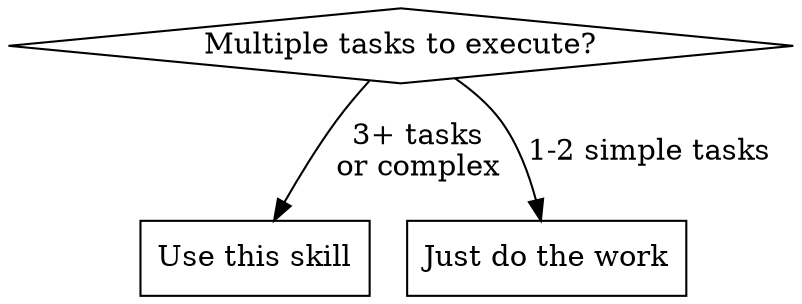
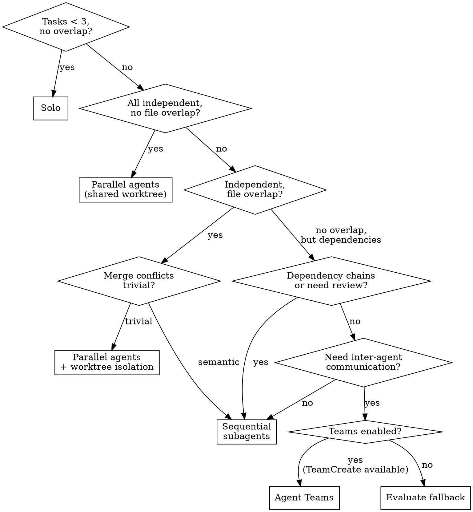

# Orchestration Strategy

Select the most cost-efficient orchestration approach for a multi-task workload, then hand off to the appropriate execution skill with explicit constraints.

**Core principle:** Use the cheapest strategy that satisfies the task's coordination needs. Don't reach for Agent Teams when parallel agents suffice. Don't parallelize when sequential is safer.

**Announce at start:** "I'm using the orchestration-strategy skill to evaluate the best approach for this work."

## The Four Strategies

| Strategy | Mechanism | Cost | Speed | When |
|----------|-----------|------|-------|------|
| **Solo** | Do it yourself | 1x | Slowest | < 3 tasks, no complexity |
| **Parallel agents** | Multiple Agent tool calls | ~Nx | Fastest | Independent tasks |
| **Sequential subagents** | One Agent at a time with review | ~Nx | Moderate | Dependencies, file overlap |
| **Agent Teams** | TeamCreate + persistent teammates | 3-7x | Fastest coordinated | Inter-agent communication needed |

Parallel and sequential have similar **token cost** (~Nx). They differ in **wall-clock time** (parallel is faster) vs **integration risk** (sequential is safer).

## When to Use This Skill



## Decision Process

### Step 1: Gather Inputs

Before deciding, you MUST read:
- **The implementation plan** — task definitions, file modifications, dependency graph
- **Actual source files** — files that multiple tasks reference, to assess overlap severity
- **Backlog/task list** — if no formal plan

If the plan doesn't specify which files each task modifies, read the codebase to infer this.

### Step 2: Evaluate Decision Criteria

| Dimension | Question |
|-----------|----------|
| Task count | How many tasks? (< 3 with no overlap → solo) |
| Independence | Can tasks run without shared state? |
| File overlap | Do tasks modify the same files? |
| Merge complexity | If overlap exists — trivial or semantic? (see below) |
| Communication needs | Do workers need to discuss, debate, or negotiate mid-work? |
| Review requirements | Need quality gates between tasks? |
| Cost efficiency | What's the cheapest strategy that works? |

### Step 3: Assess Merge Complexity

This determines whether worktree isolation can enable parallelism despite file overlap. Look at concrete signals:

- **Read the plan** — two tasks modifying the same function/struct/block = semantic overlap
- **Read the actual files** — monolithic struct, single large match block, or shared state object = semantic
- **Count shared modification sites** — 0-1 shared files with additive changes (new functions, new modules) = trivial
- **Heuristic:** If > 50% of tasks modify the same file in the same region → default to sequential

**When uncertain, prefer sequential.** The cost of conflict resolution exceeds the cost of slightly slower execution.

### Step 4: Select Strategy



**Detecting Agent Teams:** Check if the TeamCreate tool is available. If it's not in the tool list, teams are not enabled.

**Fallback when teams unavailable:** Evaluate whether parallel agents or sequential subagents is the better fallback. Explain the trade-off to the user: "Agent Teams would be ideal here for inter-agent communication, but the feature isn't enabled. Falling back to [chosen strategy] — the trade-off is [specific limitation]."

## Worktrees as a Parallelism Enabler

Worktrees don't just provide isolation — they expand the set of tasks eligible for parallelism. Without worktrees, file overlap forces sequential execution. With worktrees, file overlap only forces sequential execution when conflicts would be **semantic** (shared structs, same code blocks).

**Key question:** Is the time saved by parallelism worth the merge conflict resolution cost?

- Additive changes to a shared file (new mod declarations, new routes) → **worktrees viable**
- Modifications to the same struct/function/match block → **sequential safer**
- > 50% of tasks touch the same region of the same file → **definitely sequential**

## Handoff to Downstream Skill

After selecting a strategy, you MUST communicate these constraints to the downstream skill. This is a checklist — ensure every applicable item is explicitly stated in your instructions:

- [ ] **Which skill to invoke** (dispatching-parallel-agents / subagent-driven-development / agent-team-development)
- [ ] **Isolation strategy** (shared worktree / detached HEAD worktree / serialize)
- [ ] **Whether cherry-pick integration is needed** (yes if worktrees used)
- [ ] **Integration ordering** (dependency-topological)
- [ ] **Autonomy level** for teams (self-organizing / lead-controlled; default that workflow may override per-task)
- [ ] **Model selection** (Sonnet default, Opus for complex/critical)

This is enforced by natural language instructions in context — there is no structured API. Be explicit.

### Handoff Examples

**Parallel agents, no overlap:**
"Use dispatching-parallel-agents. Tasks are fully independent with no shared files. Shared worktree is fine. Use Sonnet for agents."

**Parallel agents, trivial overlap + worktrees:**
"Use dispatching-parallel-agents. Each agent MUST use `isolation: "worktree"` on the Agent tool. Agents MUST squash all work into a single commit (`git reset --soft $BASE && git commit`) and report the commit hash. After all agents complete, cherry-pick commits in dependency order, verifying build + tests after each. See the cherry-pick integration protocol."

**Sequential subagents:**
"Use subagent-driven-development. Sequential execution avoids file conflicts. No worktree isolation needed. Use Sonnet for agents."

**Agent Teams:**
"Use agent-team-development. Default autonomy: self-organizing. Use detached HEAD worktree isolation per teammate. Sonnet for all teammates. See the cherry-pick integration protocol for integration."

## Cherry-Pick Integration Protocol

This applies whenever worktree isolation is used (parallel agents or Agent Teams).

### Worktree Setup

**Location:** `.claude/worktrees/<task-id>/`
**Creation:** `git worktree add --detach .claude/worktrees/<task-id>`
**Why detached HEAD:** No branches to clean up. Commit hash is the only artifact. `git gc` prunes unreachable commits after worktree removal.

### Agent Contract

Each agent in a worktree:
1. Records initial HEAD: `BASE=$(git rev-parse HEAD)`
2. Does the work, may make multiple intermediate commits
3. **Squashes to single commit before reporting:**
   ```
   git reset --soft $BASE
   git commit -m "<task-id>: <description>"
   ```
4. Reports commit hash to leader
5. Stays alive until leader confirms integration complete

Leader collects: `{ task_id → commit_hash }`

### Shipping Strategy

Before integration, ask the user:
1. **Single branch, one PR** — all tasks cherry-picked onto one feature branch
2. **Separate branches per task** — individual PRs, stacked for dependent tasks (linear chains only; DAG dependencies fall back to option 1)
3. **Just integrate locally** — cherry-pick onto current branch, user handles shipping

### Integration Loop

In topological dependency order (dependencies first, then smallest-diff-first for independents):

1. `git cherry-pick <commit_hash>`
2. If succeeds → run build + tests (commands from plan or CLAUDE.md; ask user if unknown)
3. Pass → continue to next
4. Conflict → resolve using both task descriptions (see below)
5. Test failure → diagnose, fix, re-verify

### Conflict Resolution

1. Read conflict markers in affected files
2. Identify both tasks: Task A (current HEAD) and Task B (failing cherry-pick)
3. Read both task descriptions from the plan — understand what each changed and why
4. Resolve preserving both intents
5. `git add <files> && git cherry-pick --continue`
6. Verify build + tests

**When NOT to auto-resolve** — surface to the user:
- Tasks have contradictory intents
- Resolution requires an architectural decision
- Repeated test failures after resolution
- Conflict spans many files or is too complex

### Worktree Cleanup

After integration verified and agents shut down:
```
git worktree remove .claude/worktrees/<task-id>
```
No branch cleanup needed. Unreachable commits pruned by `git gc`.

## Re-evaluation at Tier Boundaries

A **batch** is all tasks at the same tier in the dependency graph — all tasks whose dependencies have been satisfied.

After integrating a batch, **re-run the decision analysis** on remaining tasks. Characteristics may have changed — a foundation task landing may unlock parallel work that wasn't viable before. This is an explicit step, not optional.

## Common Mistakes

| Mistake | Why it's wrong |
|---------|---------------|
| Defaulting to "solo" for all work | You lose the benefits of fresh-context subagents (no stale state, focused scope) |
| Parallelizing tasks with semantic file overlap | Merge conflicts cost more than the time saved |
| Using Agent Teams when parallel agents suffice | 3-7x cost for zero coordination benefit |
| Inventing ad-hoc file batching instead of using worktrees | The worktree + cherry-pick protocol exists — use it |
| Not considering cost as a decision factor | Token costs vary 1x to 7x depending on strategy |
| Forgetting to re-evaluate after a batch | The optimal strategy may change as tasks complete |

## Red Flags

- "I'll just do it all myself" for 5+ tasks → consider subagents
- "Let's parallelize everything" without checking file overlap → check merge complexity first
- "We need Agent Teams" for well-defined tasks with no inter-agent communication → parallel agents or sequential is cheaper
- Not mentioning worktree isolation when routing to parallel agents with file overlap → explicit constraint required
- No cost reasoning in the decision → always state why the chosen strategy is cost-efficient
